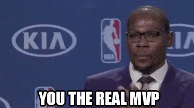

# NeuroQuack

NeuroQuack is an AI-powered Twitch bot that brings advanced image generation and analysis directly to your Twitch chat. Using Replicate's cutting-edge AI models, it enables streamers and viewers to create, transform, and analyze images through simple chat commands.



## What It Does

NeuroQuack transforms your Twitch chat into an AI art studio where users can:

- **Generate Images**: Create stunning visuals from text prompts using Stable Diffusion XL
- **Personalize Content**: Transform profile pictures into custom artwork, emotes, and videos
- **Analyze Images**: Get AI-powered descriptions and captions for any image
- **Create Videos**: Generate animated content from static images
- **Interactive AI**: Engage with language models for text generation

## Features

### 🎨 Image Generation
- `@ducktronaut sdxl <prompt>` - Generate images using Stable Diffusion XL
- `@ducktronaut pp-photomaker @username <prompt>` - Create personalized images using someone's profile picture
- `@ducktronaut url-photomaker <image_url> <prompt>` - Generate images from custom URLs
- `@ducktronaut emote @username <prompt>` - Create custom emotes from profile pictures
- `@ducktronaut emote-url <image_url> <prompt>` - Create emotes from custom images

### 📄 Image Analysis
- `@ducktronaut clip @username` - Get AI description of someone's profile picture
- `@ducktronaut blip @username` - Generate captions for profile pictures
- `@ducktronaut clip <image_url>` - Analyze any image URL
- `@ducktronaut blip <image_url>` - Caption any image URL

### 🎬 Video Generation
- `@ducktronaut pp-video @username <prompt>` - Create videos from profile pictures
- `@ducktronaut animate-diff <prompt>` - Generate animated content

### 💬 Text Generation
- `@ducktronaut llm-neural <prompt>` - Generate text using neural language models

### 🛠️ Utility Commands
- `@ducktronaut help` - Show available commands
- `@ducktronaut commands` - List all commands
- `@ducktronaut ping` - Test bot connectivity
- `@ducktronaut set-style <style>` - Set image generation style
- `@ducktronaut list-styles` - Show available styles
- `@ducktronaut github` - Link to GitHub repository
- `@ducktronaut discord` - Join Discord community

## Tech Stack

- **Backend**: FastAPI with Python
- **Twitch Integration**: TwitchIO for chat connectivity
- **AI Models**: Replicate for model inference
- **Image Generation**: Stable Diffusion XL, PhotoMaker
- **Image Analysis**: CLIP, BLIP
- **Deployment**: Docker containers
- **Cloud**: AWS (SageMaker, S3, Route53) with Massdriver

## Quick Start

### Prerequisites
- Docker installed
- Twitch bot token from [Twitch Token Generator](https://twitchtokengenerator.com)
- Replicate API token

### Setup
1. Clone the repository
2. Set your environment variables:
   ```bash
   export REPLICATE_API_TOKEN="your_replicate_token"
   export REPLICATE_ORG="your_replicate_org"
   ```

3. Build and run with Docker:
   ```bash
   just docker-build
   just docker-run
   ```

4. Start the bot:
   ```bash
   curl --location 'http://localhost:8080/start_bot' \
   --header 'Content-Type: application/json' \
   --data '{"twitch_token": "YOUR_BOT_TOKEN", "initial_channels": "YOUR_CHANNEL_NAME"}'
   ```

5. Test in your Twitch chat:
   ```
   @ducktronaut ping
   @ducktronaut sdxl a beautiful sunset over mountains
   @ducktronaut clip @yourusername
   ```

### Stop the Bot
```bash
curl --location --request POST 'http://localhost:8080/stop_bot' \
--header 'Content-Type: application/json'
```

## Development

### Local Development
```bash
cd app
uvicorn main:app --reload
```

### Docker Commands
```bash
just docker-build    # Build Docker image
just docker-run      # Run container
just docker-logs     # View logs
just docker-stop     # Stop container
just rebuild         # Rebuild and restart
```

## Configuration

### Environment Variables
- `REPLICATE_API_TOKEN` - Your Replicate API token
- `REPLICATE_ORG` - Your Replicate organization name
- `BOT_NAME` - Name of your Twitch bot (default: "ducktronaut")

### Bot Configuration
The bot uses the prefix `@<BOT_NAME>` for commands. For example, if your bot is named "ducktronaut", users would type:
- `@ducktronaut sdxl a cat wearing a hat`
- `@ducktronaut clip @username`

## AI Models Used

- **Stable Diffusion XL**: High-quality image generation
- **PhotoMaker**: Personalized image creation
- **CLIP**: Image understanding and description
- **BLIP**: Image captioning
- **Background Removal**: Clean image processing
- **Video Generation**: Animated content creation

## Contributing

1. Fork the repository
2. Create a feature branch
3. Make your changes
4. Test thoroughly
5. Submit a pull request

## Support

- **Twitch**: [DuckTapeDevOps](https://twitch.tv/ducktapedevops)
- **Discord**: [Join our community](https://discord.gg/t5DVy7DdBP)
- **GitHub**: [DuckTapeDevOps](https://github.com/DuckTapeDevOps)

## License

See [LICENSE](LICENSE) file for details.

---

*Bring AI-powered creativity to your Twitch stream with NeuroQuack!* 🦆✨